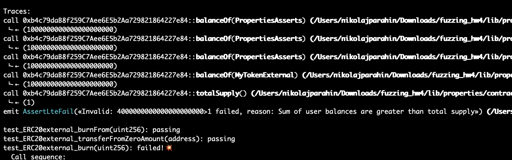
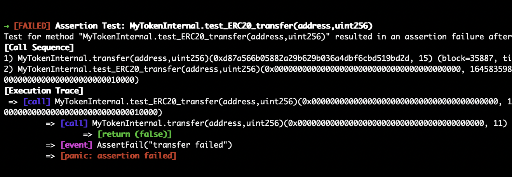

## HW4 : Fuzzing
Резюме: Задание сделано с использованием echidna и medusa.




### Установка необходимых зависимостей

```bash
brew install echidna
brew install medusa
forge init echidna
forge install crytic/properties
forge install OpenZeppelin/openzeppelin-contracts
forge install transmissions11/solmate
```

### Запуск фаззинга echidna

```bash
echidna src/MyTokenExternal.sol --contract MyTokenExternal --config src/external.yml
echidna src/MyTokenInternal.sol --contract MyTokenInternal --config src/internal.yml
```

### Запуск фаззинга medusa

```bash
medusa fuzz --target-contracts MyTokenExternal --config external.json
medusa fuzz --target-contracts MyTokenInternal --config internal.json
```

### Отчет

#### External: Echidna

1. test_ERC20external_userBalanceNotHigherThanSupply()
   i.  User balance higher than total supply
   ii. totalSupply возвращает константу (1), из-за чего балансы пользователей не соответствуют общему кол-ву выпущенных токенов
   iii.
   ```sol
    function totalSupply()
        public
        pure
        virtual
        override(ERC20)
        returns (uint256)
    {
        return 1;
    }
   ```
2. test_ERC20external_mintTokens()
   i. Mint failed to update total supply
   ii. Из-за неправильной реализации функции totalSupply нет изменений состояния
   iii.
   ```sol
    function totalSupply()
        public
        pure
        virtual
        override(ERC20)
        returns (uint256)
    {
        return 1;
    }
   ```
3. test_ERC20external_transfer()
   i. Source balance incorrect after burn
   ii. Взяли и заблокировали перевод на нулевой адрес, хотя такого не должно быть и не согласуется с поведением ERC20
   iii.
   ```sol
   function transfer(
    address to,
    uint256 amount
    ) public virtual override returns (bool) {
    if (to == address(0)) {
        return false; // Запрещаем transfer в zero address
    }
    return super.transfer(to, amount);
    }
   ```
4. test_ERC20external_userBalancesLessThanTotalSupply()
   i. Sum of user balances are greater than total supply
   ii. Данная ошибка связана с тем, что баланс пользователя не соответствует totalSupply, а такде происходит увеличение.
   ```sol
   function totalSupply()
    public
    pure
    virtual
    override(ERC20)
    returns (uint256)
    {
    return 1;
    }
    function transferFrom(
        address from,
        address to,
        uint256 amount
    ) public virtual override returns (bool) {
        if (from == to) {
            amount += 1000; // Увеличиваем amount для self-transfers
        }
        return super.transferFrom(from, to, amount);
    }
   ```
5. test_ERC20external_burn(uint256)
    i. Source balance incorrect after burn
    ii. Мы взяли и восстановили сожженое, чего, конечно, не должно быть
    iii. 
    ```sol
    function burn(uint256 amount) public virtual override {
    super.burn(amount);
    _mint(msg.sender, amount); // Восстанавливаем сожженное
    }
    ```
6. test_ERC20external_transferZeroAmount(address)
    i. Zero amount transfer failed
    ii. Взяли и перевели 0, но он не перевелся на нулевой адрес из-за  return false
    iii.
    ```sol
    function transfer(
    address to,
    uint256 amount
    ) public virtual override returns (bool) {
    if (to == address(0)) {
        return false; // Запрещаем transfer в zero address
    }
    return super.transfer(to, amount);
    }
    ```

#### Internal : Echidna

1. test_ERC20_userBalanceNotHigherThanSupply()
   i. User balance higher than total supply
   ii.  Суммарные балансы пользователей превышают значение totalSupply
   iii.
   ```sol
   function totalSupply()
    public
    pure
    override(ERC20, MyToken)
    returns (uint256)
    {
    return 1;
    }
   ```
2. test_ERC20_mintTokens()
   i. Invalid: 1!=2, reason: Mint failed to update total supply
   ii.  Вызов метода mint не увеличивает totalSupply, что нарушает спецификацию ERC20. После вызова mint суммарный баланс всех пользователей становится больше, чем totalSupply
   iii.
   ```sol
    function mint(
    address to,
    uint256 amount
    ) public override(MyToken, CryticERC20MintableProperties) {
    MyToken.mint(to, amount);
    }
    function totalSupply()
    public
    pure
    override(ERC20, MyToken)
    returns (uint256)
    {
    return 1;
    }
   ```
3. test_ERC20_transfer
   i. transfer failed
   ii. Метод transfer возвращает false при попытке перевода токенов на адрес 0x0. Это действие некорректно согласно спецификации ERC20, где перевод на 0x0 эквивалентен "сжиганию" токенов
   iii.
   ```sol
   function transfer(
    address to,
    uint256 amount
    ) public override(ERC20, MyToken) returns (bool) {
    if (to == address(0)) {
        return false;
    }
    return super.transfer(to, amount);
    }
   ```
4. test_ERC20_burn
   i. Invalid: 2!=0, reason: Source balance incorrect after burn
   ii. Метод burn вместо уничтожения токенов восстанавливает их через _mint. Это нарушает логику работы burn и может вызывать неожиданные результаты
   iii.
   ```sol
   function burn(uint256 amount) public override(ERC20Burnable, MyToken) {
    super.burn(amount);
    _mint(msg.sender, amount);
    }
   ```
5. test_ERC20_usersBalancesNotHigherThanSupply
   i. Invalid: 2!=0, reason: Source balance incorrect after burn
   ii. уммарные балансы всех пользователей превышают значение totalSupply. Это связано с фиксацией totalSupply на 1 и несоответствием балансов, обновляемых через mint
   iii.
   ```sol
   function totalSupply()
    public
    pure
    override(ERC20, MyToken)
    returns (uint256)
    {
    return 1;
    }
   ```
6. test_ERC20_transferZeroAmount
    i. Zero amount transfer failed
    ii. Тест на нулевой перевод завершается с ошибкой. Вызов метода transfer с нулевым значением приводит к нарушению :)
    iii.
    ```sol
    function transfer(
    address to,
    uint256 amount
    ) public override(ERC20, MyToken) returns (bool) {
    if (to == address(0)) {
        return false;
    }
    return super.transfer(to, amount);
    }
    ```

#### External : Medusa

1) MyTokenExternal.test_ERC20external_userBalanceNotHigherThanSupply()
   i.  User balance higher than total supply
   ii. totalSupply возвращает константу (1), из-за чего балансы пользователей не соответствуют общему кол-ву выпущенных токенов
   iii.
   ```sol
    function totalSupply()
        public
        pure
        virtual
        override(ERC20)
        returns (uint256)
    {
        return 1;
    }
   ```
2) MyTokenExternal.test_ERC20external_userBalancesLessThanTotalSupply()
   i.  Sum of user balances are greater than total supply
   ii. totalSupply возвращает константу (1), из-за чего балансы пользователей не соответствуют общему кол-ву выпущенных токенов
   iii.
   ```sol
    function totalSupply()
        public
        pure
        virtual
        override(ERC20)
        returns (uint256)
    {
        return 1;
    }
   ```
3) MyTokenExternal.test_ERC20external_burn(uint256)
   i. Invalid: 1000000000000000000000!=448831837684723992488, reason: Source balance incorrect after burn
   ii. Неверный перевод и восстановление
   iii.
   ```sol
   function burn(uint256 amount) public virtual override {
        super.burn(amount);
        _mint(msg.sender, amount); // Восстанавливаем сожженное
    }
    function transferFrom(
        address from,
        address to,
        uint256 amount
    ) public virtual override returns (bool) {
        if (from == to) {
            amount += 1000; // Увеличиваем amount для self-transfers
        }
        return super.transferFrom(from, to, amount);
    }
   ```
4) MyTokenExternal.test_ERC20external_mintTokens(address,uint256)
   i. Mint failed to update total supply
   ii. Из-за неправильной реализации функции totalSupply нет изменений состояния
   iii.
   ```sol
    function totalSupply()
        public
        pure
        virtual
        override(ERC20)
        returns (uint256)
    {
        return 1;
    }
   ```
5) MyTokenExternal.test_ERC20external_transfer(address,uint256)
   i. transfer failed
   ii. Ошибка перевода на нулевой адрес
   iii.
   ```sol
   function transfer(
        address to,
        uint256 amount
    ) public virtual override returns (bool) {
        if (to == address(0)) {
            return false; // Запрещаем transfer в zero address
        }
        return super.transfer(to, amount);
    }
   ```
6) MyTokenExternal.test_ERC20external_burnFrom(uint256)
   i. Invalid: 1!=0, reason: Total supply incorrect after burnFrom
   ii. Неверный перевод на нулевой адрес и неверная реализация totalSupply
   iii.
   ```sol
   function totalSupply()
        public
        pure
        virtual
        override(ERC20)
        returns (uint256)
    {
        return 1;
    }

   ```
7) MyTokenExternal.test_ERC20external_transferZeroAmount(address)
    i. Zero amount transfer failed
    ii. Взяли и перевели 0, но он не перевелся на нулевой адрес из-за  return false
    iii.
    ```sol
    function transfer(
    address to,
    uint256 amount
    ) public virtual override returns (bool) {
    if (to == address(0)) {
        return false; // Запрещаем transfer в zero address
    }
    return super.transfer(to, amount);
    }
    ```

#### Internal : Medusa

1) MyTokenInternal.test_ERC20_userBalanceNotHigherThanSupply()
    i.  User balance higher than total supply
    ii. totalSupply возвращает константу (1), из-за чего балансы пользователей не соответствуют общему кол-ву выпущенных токенов
    iii.
   ```sol
    function totalSupply()
        public
        pure
        virtual
        override(ERC20)
        returns (uint256)
    {
        return 1;
    }
   ```
2) MyTokenInternal.test_ERC20_usersBalancesNotHigherThanSupply()
    i.  Sum of user balances are greater than total supply
   ii. totalSupply возвращает константу (1), из-за чего балансы пользователей не соответствуют общему кол-ву выпущенных токенов
   iii.
   ```sol
    function totalSupply()
        public
        pure
        virtual
        override(ERC20)
        returns (uint256)
    {
        return 1;
    }
   ```
3) MyTokenInternal.test_ERC20_burn(uint256)
    i. Invalid: 1000000000000000000000!=448831837684723992488, reason: Source balance incorrect after burn
   ii. Неверный перевод и восстановление
   iii.
   ```sol
   function burn(uint256 amount) public virtual override {
        super.burn(amount);
        _mint(msg.sender, amount); // Восстанавливаем сожженное
    }
    function transferFrom(
        address from,
        address to,
        uint256 amount
    ) public virtual override returns (bool) {
        if (from == to) {
            amount += 1000; // Увеличиваем amount для self-transfers
        }
        return super.transferFrom(from, to, amount);
    }
   ```
4) MyTokenInternal.test_ERC20_transfer(address,uint256)
    i. transfer failed
   ii. Ошибка перевода на нулевой адрес
   iii.
   ```sol
   function transfer(
        address to,
        uint256 amount
    ) public virtual override returns (bool) {
        if (to == address(0)) {
            return false; // Запрещаем transfer в zero address
        }
        return super.transfer(to, amount);
    }
   ```
5) MyTokenInternal.test_ERC20_mintTokens(address,uint256)
    i. Mint failed to update total supply
   ii. Из-за неправильной реализации функции totalSupply нет изменений состояния
   iii.
   ```sol
    function totalSupply()
        public
        pure
        virtual
        override(ERC20)
        returns (uint256)
    {
        return 1;
    }
   ```
6) MyTokenInternal.test_ERC20_burnFrom(uint256)
    i. Invalid: 1!=0, reason: Total supply incorrect after burnFrom
   ii. Неверный перевод на нулевой адрес и неверная реализация totalSupply
   iii.
   ```sol
   function totalSupply()
        public
        pure
        virtual
        override(ERC20)
        returns (uint256)
    {
        return 1;
    }

   ```
7) MyTokenInternal.test_ERC20_transferZeroAmount(address)
   i. Zero amount transfer failed
    ii. Взяли и перевели 0, но он не перевелся на нулевой адрес из-за  return false
    iii.
    ```sol
    function transfer(
    address to,
    uint256 amount
    ) public virtual override returns (bool) {
    if (to == address(0)) {
        return false; // Запрещаем transfer в zero address
    }
    return super.transfer(to, amount);
    }
    ```
